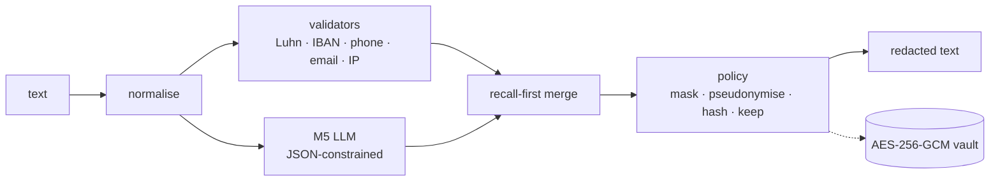

# PII Redaction Gateway

A self-hosted gateway that finds personal data in English customer-support text and masks or pseudonymises it before the text is logged, analysed or sent to an external LLM. The detector is **M5**, Qwen3-1.7B fine-tuned with QLoRA for about $1 per run, backed by deterministic validators. It is benchmarked blind against Presidio, GLiNER-PII and OpenMed's privacy filter.

> **Try the model:** [huggingface.co/spaces/Othocs/pii-gateway-demo](https://huggingface.co/spaces/Othocs/pii-gateway-demo). It's a hosted demo with M5 on a serverless GPU; use fictional data, and the first request may take ~3 min ([`docs/DEMO.md`](docs/DEMO.md)).
>
> **Status: concluded (October 2026).**
>
> - **Research:** a full write-up is in [`docs/REPORT.md`](docs/REPORT.md).
> - **Gateway:** validators, normalisation, recall-first merge, policies, AES-256-GCM vault, and FastAPI `/redact`, `/restore` and `/proxy`.
> - **Packaging:** CPU and GPU Docker images, and a Gradio demo.
>
> The adapter is documented in [`MODEL_CARD.md`](MODEL_CARD.md) but not published.

## Results


**Leakage** is the share of gold PII characters left unmasked (lower is better). M5 is averaged over 3 seeds, with 95% CIs from 1,000 document resamples, and each test set was scored once. Over-redaction (%) is in parentheses.

| Test set | Status for M5 | M5 | M5 + validators (gateway) | OpenMed | GLiNER-PII | Presidio |
| --- | --- | --- | --- | --- | --- | --- |
| Support desk (300, LLM-drafted) | unseen | **1.70** [0.82, 2.78] (5.8) | **1.25** | 3.54 (16.1) | 8.11 (23.2) | 18.91 (23.1) |
| TAB (127 real court cases) | unseen | 15.91 [13.92, 18.42] (5.2) | 15.87 | 14.91 (6.8) | 19.29 (17.6) | **11.23** (34.1) |
| **ABCD (1,002 real human chats)** | unseen | 2.55 [2.04, 3.15] (48.4) | 2.34 | 0.73 (42.5) | **0.26** (32.4) | 8.76 (59.6) |
| OpenPII held-out region (2,000) | unseen | **0.70** [0.60, 0.82] (0.6) | 0.66 | 0.80 (1.4) | 6.31 (5.7) | 35.67 (19.0) |
| OpenPII test (5,000) | in-dist. | 0.60 [0.54, 0.69] (0.5) | 0.55 | not run | not run | not run |
| Nemotron-PII test (3,000) | in-dist. | 2.64 [2.25, 3.09] (3.5) | 2.41 | **1.33** (4.2) | 5.02 (11.9) | 12.87 (31.6) |
| Gretel EN test (1,000) | in-dist. | **11.43** [10.13, 12.83] (9.9) | 11.24 | 29.23 (34.4) | 25.51 (35.7) | 29.05 (58.5) |

**What the evidence supports:**
- **Structured and synthetic text: M5 leads or ties.** It beats every baseline on LLM-drafted support messages (−1.8 to −17.2 pt, CIs excluding 0) at a third of their over-redaction. It ties OpenMed on an unseen region, and beats the encoders by 14–18 pt on Gretel-style documents.
- **Real legal text: M5 is competitive, not best.** It ties OpenMed on TAB and beats GLiNER-PII. Presidio leaks less there, but 34% of what it masks isn't PII.
- **Real chats: M5 doesn't win.** On ABCD's human-typed customer-service chats, GLiNER-PII and OpenMed leak less (+2.3 and +1.8 pt). The support-desk advantage came from LLM-drafted test text and does not transfer. All of M5's training data is generated or templated, which is the most likely cause.
- **Data beats hyperparameters.** Learning rate over a 12× range, and rank 16 against 32, changed nothing measurable. A second and third data source, and 2k targeted messages, each moved results by 10–23 pt.
- **Single seeds vary.** On small conversational sets they differ by about 1.5 pt, so seed-averaged numbers are reported.
- **Live gateway:** on one A40, median 0.38 s and p95 1.08 s per support message.

The total cost was about **$21.30**. More figures, the full tables and the discussion are in [`docs/REPORT.md`](docs/REPORT.md); the protocol is in [`docs/EVALUATION.md`](docs/EVALUATION.md); every rule was logged before each run in [`results/sweeps/DECISIONS.md`](results/sweeps/DECISIONS.md).

## How it works



1. **Normalise:** NFKC, zero-width stripping and look-alike characters, with an offset map back to the original.
2. **Detect:** the validators only flag values that pass their check, such as Luhn for cards, so gift-card numbers aren't masked. M5 lists values as JSON, and code aligns them to exact spans.
3. **Merge:** anything either detector flags is redacted.
4. **Apply the policy:** per label, from YAML.
5. **Pseudonymise:** pseudonyms are stored in an encrypted, scope-bound vault, so `/restore` and `/proxy` can put the values back.

**Safety:**
- **Fails closed.** A detection error returns 503 and never the input.
- **No values in logs**, enforced by a canary test.
- **`/proxy` is the only outbound route**, and the upstream only sees redacted text.

Details: [`docs/ARCHITECTURE.md`](docs/ARCHITECTURE.md).

## Quickstart

```bash
make setup        # uv sync (data, presidio, gliner, serve, demo extras)
make test         # unit tests, no model downloads
make serve        # gateway on :8000, validators only (CPU)
```

```bash
curl -s localhost:8000/redact -H 'Content-Type: application/json' \
  -d '{"text": "Card 4111 1111 1111 1111, mail ann.lee@example.com", "policy": "support"}'
# {"redacted": "Card [CREDITCARDNUMBER], mail [EMAIL]", "entities": [...], ...}
```

| Goal | Command |
| --- | --- |
| Demo UI (Redact tab, talks to the gateway) | `make demo` → http://127.0.0.1:7860 |
| Docker, CPU (validators only) | `make docker-smoke`, or `docker compose -f docker/compose.yaml --profile cpu up` |
| Docker, GPU (M5 + validators) | `docker compose -f docker/compose.yaml --profile gpu up`, on an NVIDIA host with the adapter in `outputs/hpo/m5_targeted` |
| Safe LLM calls | Set `PII_UPSTREAM_URL` to any OpenAI-compatible API, then `POST /proxy` with `{"messages": [...]}`. The reply comes back with pseudonyms restored |
| The full gateway with M5 on a GPU host | `PII_DETECTOR=lora PII_ADAPTER=outputs/hpo/m5_targeted make serve` |

Secrets (`PII_VAULT_KEY`, `PII_API_KEY`, `PII_RESTORE_KEY`) go in the environment or in `docker/gateway.env`; see [`docker/README.md`](docker/README.md).

## Reproducing the research

- **Where things run:** data preparation, metrics, figures and tests run on a laptop (`make data`, `make eval-data`, `make figures`). Training and LLM evaluation run on a rented GPU, never locally.
  - **Setup:** pods clone this repo over `ssh -A` ([`scripts/pod_setup.sh`](scripts/pod_setup.sh)), so no credential is copied to them.
  - **Runs:** each phase is a run list in [`configs/sweeps/`](configs/sweeps), executed by [`scripts/pod_sweep.sh`](scripts/pod_sweep.sh).
- **Training:** QLoRA (4-bit NF4 base, bf16 compute) with TRL's `SFTTrainer`, loss on the answer only. Each run writes `run_info.json` with its GPU, VRAM, wall time, throughput and cost.
- **Evaluation:** vLLM with JSON-schema-constrained decoding; baselines through their own libraries. Results go to `results/<system>__<set>.json`. Seed-averaged tables with CIs are built by `python -m eval.phase4_report`.

The steps end to end are in [`docs/REPORT.md`](docs/REPORT.md), appendix B.

## Documentation

| | |
| --- | --- |
| [`docs/REPORT.md`](docs/REPORT.md) | The research report: method, every experiment, results, discussion, limitations |
| [`docs/EVALUATION.md`](docs/EVALUATION.md) | Metrics, statistics, test sets, how rules were set before runs, errata |
| [`docs/DATASETS.md`](docs/DATASETS.md) | Data cards and licences for every training and test set |
| [`docs/ARCHITECTURE.md`](docs/ARCHITECTURE.md) | Gateway design, API, security model, deployment |
| [`docs/DEMO.md`](docs/DEMO.md) | The hosted demo: Space + RunPod Serverless setup, cost, guardrails |
| [`MODEL_CARD.md`](MODEL_CARD.md) | M5: recipe, data, evaluation, limitations |
| [`results/SUMMARY.md`](results/SUMMARY.md) | Every result file in one table (generated) |
| [`results/sweeps/DECISIONS.md`](results/sweeps/DECISIONS.md) | Dated log of each phase's rules (set before running) and outcomes |
| [`results/ERRATA.md`](results/ERRATA.md) | Corrections |

## Scope and limitations

- **In scope:** English text; 19 PII labels plus IBAN and IP addresses; reversible pseudonymisation.
- **Out of scope:**
  - other languages;
  - images, PDFs and audio;
  - health records (PHI) and sensitive categories (religion, health, politics);
  - real customer data: every example in this repo is synthetic, LLM-drafted or from public research datasets.
- **Main limitations:**
  - M5 trails encoder models on real human chats;
  - the support-desk test sets were drafted by an LLM and not human-checked;
  - CPU latency of a quantised build was not measured.

The full list is in [`docs/REPORT.md`](docs/REPORT.md) §7.

## Repository layout

```text
src/pii_gateway/   gateway: api.py, detectors/ (validators, LLM, baselines), normalize, merge, policy, vault
eval/              metrics, run_eval, bootstrap, gateway_eval, phase4_report, figures, select, summarize
training/          train_lora.py (QLoRA)
data/              dataset builders, audit/, support_desk/, synthetic/ (targeted data), abcd/
configs/           training and sweep configs, label maps, redaction policies
scripts/           GPU pod setup, sweeps, baselines, gateway benchmark, Docker smoke test
docker/            CPU and GPU images, compose
demo/              Gradio demo
docs/              report, evaluation, datasets, architecture, figures
results/           result JSON per system and test set, phase reports, decisions log, errata
tests/             unit tests: metrics, data, gateway, proxy, canary log-leak, docs links
```

## License and citation

Code: Apache-2.0 ([`LICENSE`](LICENSE)). Dataset and model attributions: [`NOTICE`](NOTICE). Cite with [`CITATION.cff`](CITATION.cff).
