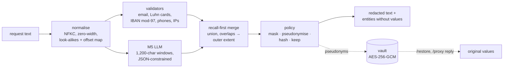

# Gateway architecture

The gateway sits between an application and anything that should not see personal data: logs, analytics, or an external LLM. It finds PII, replaces it according to a policy, and can restore it later for authorised callers. Code: [`src/pii_gateway/`](../src/pii_gateway).

## Pipeline

| Stage | Module | What it does |
| --- | --- | --- |
| Normalise | [`normalize.py`](../src/pii_gateway/normalize.py) | NFKC, zero-width stripping and Cyrillic/Greek look-alike mapping, so obfuscated values are still found. Keeps an offset map, so spans found on the normalised text map back to the original bytes |
| Validators | [`detectors/validators.py`](../src/pii_gateway/detectors/validators.py) | High-precision checks rather than bare patterns: cards must pass Luhn (so gift cards don't), IBANs must pass mod-97 with the registered length, phones must be valid for US, GB, CA or IN (libphonenumber), and IPs must parse |
| LLM | [`detectors/llm.py`](../src/pii_gateway/detectors/llm.py) | M5 through vLLM with JSON-schema-constrained decoding. Values are aligned to exact offsets in code; values it invents are dropped |
| Merge | [`merge.py`](../src/pii_gateway/merge.py) | Recall-first union: anything either detector flags is redacted. Overlapping spans merge to their outer extent, so no fragment of a value is left in clear. A validator's label wins |
| Policy | [`policy.py`](../src/pii_gateway/policy.py), [`configs/policy/`](../configs/policy) | A per-label action from YAML. `mask` gives `[EMAIL]`; `pseudonymize` gives `<EMAIL_1>` (stable within a conversation, reversible); `hash` gives a keyed HMAC; `keep` leaves the value. Policies shipped: `support`, `analytics`, `strict` |
| Vault | [`vault.py`](../src/pii_gateway/vault.py) | Maps pseudonyms back to values (below) |
| API | [`api.py`](../src/pii_gateway/api.py) | FastAPI |

## API

| Route | Auth | Request → response |
| --- | --- | --- |
| `POST /redact` | `X-API-Key` (if `PII_API_KEY` is set) | `{text, policy, tenant, conversation_id}` → `{redacted, entities: [{start, end, label, action}], policy, conversation_id}`. Entities never carry values |
| `POST /restore` | `X-Restore-Key` (`PII_RESTORE_KEY`; the route is disabled if unset) | `{text, tenant, conversation_id}` → `{restored, tokens_restored}`. Audit-logged with counts only |
| `POST /proxy` | `X-API-Key` | `{messages: [{role, content}], policy, tenant, conversation_id, model}`: each message is redacted, **only redacted text** goes to an OpenAI-compatible upstream (`PII_UPSTREAM_URL`), and the pseudonyms in the reply are restored. Returns `{reply, entities, conversation_id}`. 404 unless configured |
| `GET /health` | none | `{status, detector, vault}` |

Configuration is all through the environment:

| Variable | Purpose |
| --- | --- |
| `PII_DETECTOR` | `validators` (default, CPU) or `lora` (GPU) |
| `PII_ADAPTER` | Path to the M5 adapter, for `PII_DETECTOR=lora` |
| `PII_VAULT_KEY` | Base64, 32 bytes |
| `PII_API_KEY` | Required in `X-API-Key` when set |
| `PII_RESTORE_KEY` | Required in `X-Restore-Key`; `/restore` is disabled if unset |
| `PII_UPSTREAM_URL`, `PII_UPSTREAM_KEY`, `PII_UPSTREAM_MODEL` | Enable and configure `/proxy` |
| `PII_POLICY_DIR` | Where the policy YAML files live |

## Security model

- **Fail closed.** If detection raises, `/redact` and `/proxy` answer 503 and neither return nor forward the input. If the upstream fails, `/proxy` answers 502 without echoing the input. Validation errors (422) never echo the submitted text.
- **No values in logs.** Log lines carry counts, labels, policy, tenant and conversation IDs, and the upstream host only. This is enforced by [`tests/test_canary.py`](../tests/test_canary.py):
  - canary values are pushed through every route and error path with every logger at DEBUG;
  - the test asserts they appear in no log record, no error body, and no upstream request.

  The Docker smoke test checks container logs the same way.
- **Vault.**
  - **Encryption.** Values are encrypted with AES-256-GCM. The associated data binds each ciphertext to its tenant, conversation and token, so a ciphertext copied to another scope, or edited, fails to decrypt.
  - **Lookup.** The lookup key is an HMAC of the value, so values are never stored or indexed in clear.
  - **Lifetime.** Scopes expire after a TTL (default 24 h). The store is in memory, so a restart forgets every mapping, which is the safe failure for a redactor.
- **Key scopes.** Redacting and restoring use separate keys, so a client that may redact cannot de-pseudonymise.
- **Concurrency.** Model calls are serialised with a lock, because FastAPI's thread pool and the single in-process vLLM engine must not interleave.
- **Egress.** `/proxy` is the only route that makes outbound calls, and only when `PII_UPSTREAM_URL` is set.

## Deployment

See [`docker/README.md`](../docker/README.md).

| Image | Size | What runs | Tested |
| --- | --- | --- | --- |
| `pii-gateway:cpu` | 622 MB | Validators only, on any machine | Built and smoke-tested locally and in CI |
| `pii-gateway:gpu` | – | CUDA 13 + vLLM + M5 + validators; adapter mounted read-only, base model downloaded into a volume | Built in CI; its stack imports there. Never run in a container, because no GPU was available. Its exact command ran on an A40 outside Docker |

Both images run as non-root, and secrets come from `docker/gateway.env` at runtime (never baked in). The CPU service runs on a read-only root filesystem with `cap_drop: ALL`.

**Measured on one A40** (M5 + validators, single requests, 100 support messages):

- latency: median 0.38 s, p95 1.08 s;
- all 100 restores exact.

The offline batched throughput is in the run-level result files. Latency on CPU (GGUF / llama.cpp) was not measured.
