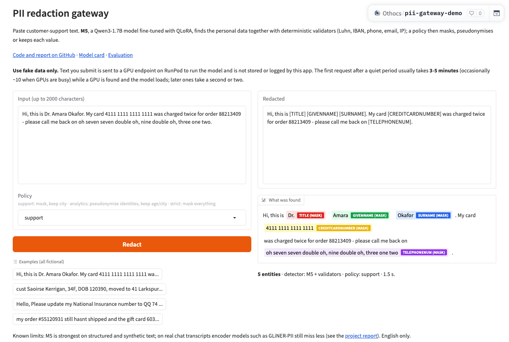

# Hosted demo

**Space:** <https://huggingface.co/spaces/Othocs/pii-gateway-demo>. It is **public** (since 2026-10-03). The RunPod endpoint runs with **max workers = 1** and min workers = 0, so it scales to zero when idle and at most one GPU is ever billed. Use fictional data only.



## Architecture

```text
browser ──► Hugging Face Space (Gradio, free CPU, HF PRO account)
              └─ pii_gateway.pipeline.Gateway: normalise → validators + M5 → merge → policy
                    └─ HTTPS ──► RunPod Serverless endpoint (scales to zero)
                                   runpod/worker-v1-vllm:v2.28.0 (vLLM 0.30.0, CUDA 13)
                                   Qwen/Qwen3-1.7B + LoRA "m5" from the private repo Othocs/pii-gateway-m5
```

- **Same code as the gateway.** The Space runs the gateway's own pipeline ([`space/app.py`](../space/app.py), [`src/pii_gateway/pipeline.py`](../src/pii_gateway/pipeline.py)).
- **Same model behaviour as the evaluation.** M5 is called through the `openai` backend of [`LLMDetector`](../src/pii_gateway/detectors/llm.py): same prompt, JSON schema and greedy decoding, with Qwen3's thinking switched off.
- **Checked.** On the 100 `support_desk_val` messages the endpoint reproduces the evaluated M5 **exactly**: 1.58% leakage, 7.54% over-redaction, strict F1 0.84, 100% valid JSON.

## Configuration

| Where | Setting | Value |
| --- | --- | --- |
| RunPod endpoint `pii-gateway-m5` | GPU pools | AMPERE_16, AMPERE_24, ADA_24 (CUDA ≥ 13) |
| | Workers | min 0, max 1, idle timeout 60 s, FlashBoot |
| | Env | `MODEL_NAME=Qwen/Qwen3-1.7B`, `ENABLE_LORA=true`, `MAX_LORA_RANK=16`, `MAX_MODEL_LEN=4096`, `LORA_MODULES={"name":"m5","path":"Othocs/pii-gateway-m5",...}`, `HF_TOKEN={{ RUNPOD_SECRET_hf_token }}` (a read-only token) |
| Space variables | `PII_LLM_URL`, `PII_LLM_MODEL` | `https://api.runpod.ai/v2/<endpoint>/openai/v1`, `m5` |
| Space secret | `PII_LLM_KEY` | RunPod API key, entered by the owner and never in the repo |

## Cost and latency

- **GPU:** $0.58–1.10 per active hour, billed per second, and $0 when idle. A visit typically uses 1–2 minutes of GPU, including the 60 s warm period, so about **$0.02**.
- **Page:** free CPU on HF PRO.
- **Latency:** a cold start (first request after idle) took 3 minutes and, in a second test, 9 minutes on 2026-10-03; most of the variance is waiting for a GPU in the shared pool. If RunPod loses a job (a worker stopped mid-start returns a 5xx), the Space resubmits it up to 3 times; if the model still can't answer, the validators-only warning names the HTTP status. Warm requests take about 2 s per message, including RunPod's queue overhead.

## Guardrails

- Inputs are capped at 2,000 characters.
- A per-visitor limit of 10 requests a minute (verified), and a global cap of 300 requests a day.
- Gradio queue concurrency is 2, and the endpoint runs at most 1 worker.
- **If the endpoint fails,** the page shows validator-only results with a warning that names, addresses and dates were not detected (verified). It never presents incompletely redacted text as complete.
- **Privacy notice on the page:** use fake data. Inputs pass through RunPod, and the app stores and logs nothing.

## Redeploying

```bash
make space-build                      # assemble space/dist and smoke-test it (validators only)
make space-push                       # upload to Othocs/pii-gateway-demo (needs `hf auth login`)
```

- **New adapter:** upload it to the private model repo, then cycle the endpoint's workers.
- **Taking the demo offline:** set the Space to private or pause it, and set the endpoint's max workers to 0.

## Going public (done 2026-10-03)

1. ~~In the Space's settings, switch visibility to **public**.~~ Done through the Hub API (`update_repo_settings(..., private=False)`).
2. Check the guardrails still match the budget you want: `DEMO_DAILY_CAP` (default 300 requests a day) and `DEMO_RATE_PER_MIN` (default 10), both set as Space variables.
3. ~~Un-pause the RunPod endpoint `pii-gateway-m5`: set **max workers = 1** (min workers stays 0).~~ Done.
   - Watch GPU usage on the RunPod billing page.
   - During testing, containers sometimes stayed up for several minutes, or once for about 30 minutes, past the 60 s idle timeout.
4. ~~Open the page once to warm it up, and try an example.~~ Done: 5 entities in 1.5 s once warm (screenshot above).
