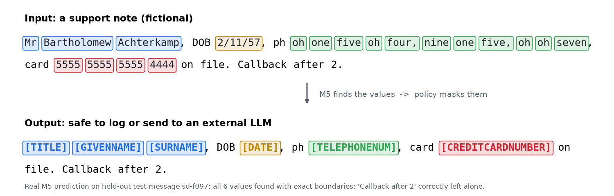
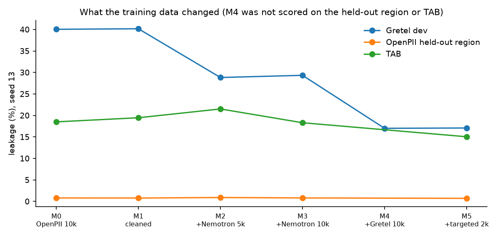
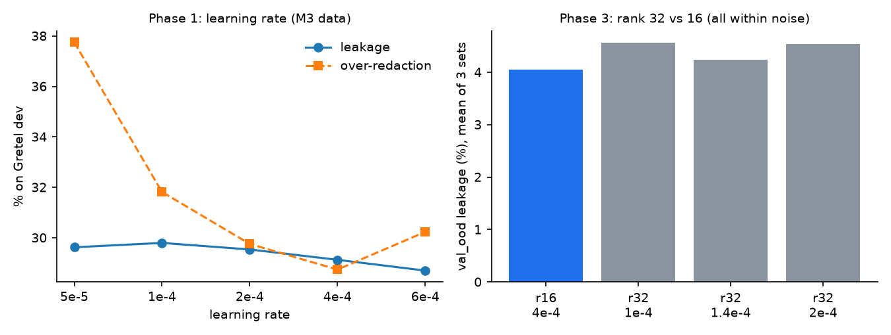
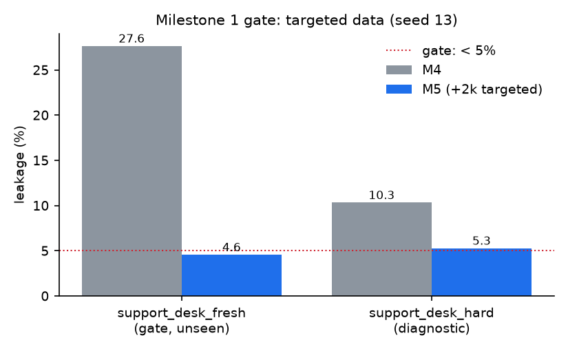
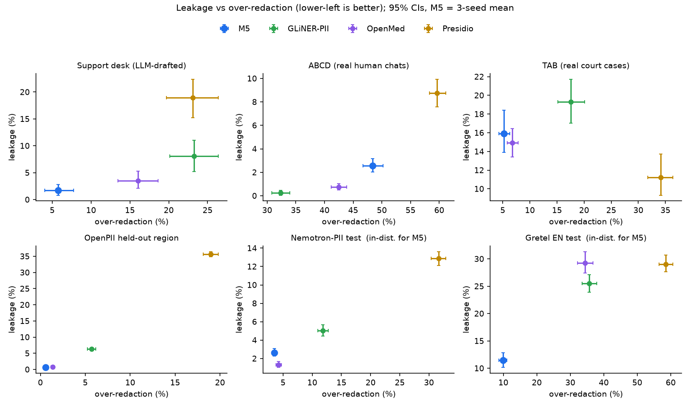
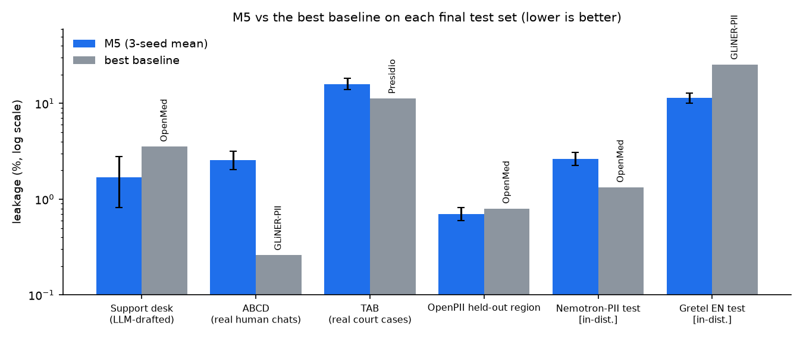
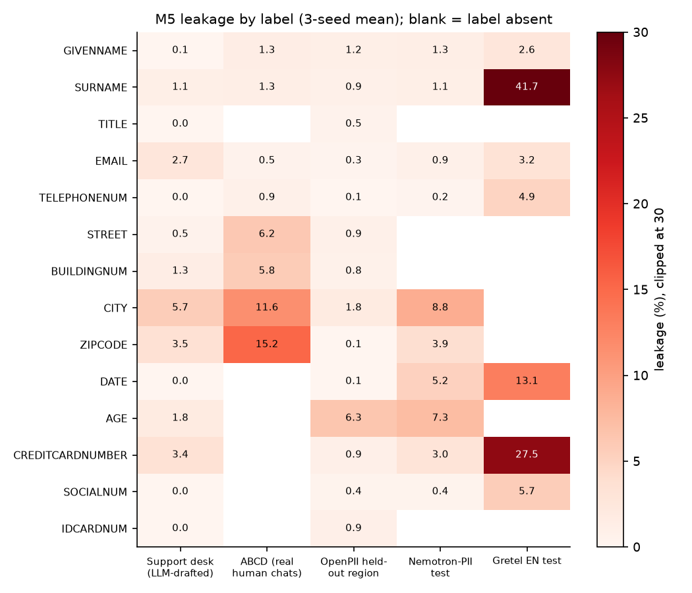

# A small fine-tuned LLM for on-premises PII redaction: what transfers and what doesn't

*Research report: PII Redaction Gateway, September–October 2026.*

*Try the model: [live demo](https://huggingface.co/spaces/Othocs/pii-gateway-demo). Code: [github.com/Othocs/pii-gateway](https://github.com/Othocs/pii-gateway).*

## Abstract

We fine-tune Qwen3-1.7B with QLoRA to list the personal data in English customer-support text, and build a self-hosted redaction gateway around it. The model's output is aligned to exact spans in code and combined with deterministic validators; a policy then masks, pseudonymises, hashes or keeps each value.

The final model, **M5**, is trained on 32k examples: three synthetic PII corpora plus 2k targeted messages for formats an earlier model missed. We evaluate it blind, with 3 seeds, document-bootstrap confidence intervals and selection rules fixed before each run.

**Where M5 leads or ties:**
- LLM-drafted support messages: **1.7%** character leakage, against 3.5–18.9% for OpenMed, GLiNER-PII and Presidio, at a third of their over-redaction;
- an unseen OpenPII region: **0.70%**, tied with OpenMed;
- Gretel-style financial documents: **11.4%**, against 25–29%.

**Where it doesn't:**
- On real court cases (TAB) it ties OpenMed.
- **On real human-typed customer-service chats (ABCD), the encoder baselines leak less**: GLiNER-PII 0.26% and OpenMed 0.73%, against M5's 2.55%.

The advantage measured on synthetic support text does not transfer to real conversations. The likely cause is that all of M5's training data is generated or templated.

**Other findings:**
- Learning rate and adapter rank barely matter; data diversity and targeted data do.
- Single-seed results on small conversational sets vary by about 1.5 pt.
- The whole study cost about **$21**.

## 1. Introduction

Customer-support text is full of personal data, and it increasingly flows to analytics pipelines and external LLMs. Sending it to a third party in order to remove the PII defeats the purpose. A redactor has to run on-premises, on every message, return exact spans, and treat a missed phone number as a data leak. GDPR names pseudonymisation as a safeguard (Art. 4(5), 25 and 32).

Small fine-tuned LLMs are attractive for this. They can read context ("call me on…", "my daughter Mina"), handle odd formats, and run on one GPU. Encoder models (GLiNER-PII, OpenMed) and rule systems (Presidio) are faster and are the standard to beat.

**Questions:**
1. Can a 1.7B model, fine-tuned for a few dollars, match or beat them?
2. Which choices matter: data, learning rate, rank?
3. Does what we measure on synthetic data hold on real text?

**Contributions:**
1. A complete, reproducible pipeline: data, QLoRA training, constrained decoding, alignment, evaluation.
2. A controlled study of training data, learning rate and rank.
3. A targeted-data method with labels exact by construction.
4. A blind 3-seed evaluation against three baselines on seven test sets, including real court cases and real human chats.
5. A production-style gateway: validators, normalisation, recall-first merge, policies, an encrypted vault, `/proxy`, Docker images and a canary log-leak test.

## 2. Related work and baselines

- **Presidio** (Microsoft): pattern recognisers plus spaCy NER. The industry default; precise on formats, weak on context.
- **GLiNER-PII** (NVIDIA) and GLiNER (Knowledgator): zero-shot span extraction with a bidirectional encoder, fine-tuned for PII.
- **OpenMed privacy filter v2**: an encoder PII model.
- **Datasets:**
  - Ai4Privacy OpenPII (synthetic, 19 labels);
  - NVIDIA Nemotron-PII (synthetic, many locales);
  - Gretel synthetic PII finance;
  - the **Text Anonymization Benchmark** (TAB; Pilán et al., 2022), real ECHR judgements with human annotation;
  - **ABCD** (ASAPP), human customer-service dialogues with fictional customer profiles.

Licences are in [`DATASETS.md`](DATASETS.md).

## 3. Method

**Task.** Given text, the model emits JSON `[{"label", "text"}]` listing every PII value, from 19 labels: names, title, age, sex, gender, date, contact details, address parts, ID numbers and card numbers. Generation is constrained by a JSON schema (vLLM structured outputs), so every output parses.

- Code aligns each value to the source left to right, with a loose fallback for spacing and punctuation.
- A value that can't be found was invented by the model. It is dropped and counted.
- Long inputs are split into windows of 1,200 characters (the training length) with 150 characters of overlap.



**Training.** QLoRA: a 4-bit NF4 base with bf16 compute, adapters on all 7 linear projections, loss on the answer only (TRL `SFTTrainer`), 1 epoch, effective batch 16, cosine schedule with 3% warmup, on one rented A40.

**Data mixes:**

| Model | Training data |
| --- | --- |
| M0 | OpenPII 10k |
| M1 | OpenPII 10k, label-cleaned |
| M2 | M1 5k + Nemotron 5k |
| M3 | M1 10k + Nemotron 10k |
| M4 | M3 + Gretel EN 10k (30k) |
| M5 | M4 + 2k targeted support messages (32k) |

**Targeted data (M5).** Python generates PII values in the formats M4 missed, from reserved or test ranges only: spoken, split and unspaced phone numbers; stacked or lowercase titles; SSN, NINO and SIN numbers and card layouts; compact dates of birth; shorthand ages. An LLM (DeepSeek) writes the carrier message around them, so it never assigns a label.

Every occurrence of a value is labelled, and messages are rejected for missing values, unlabelled digits, emails or titles, and four semantic errors found by reading pilots. Examples of those errors are a phone given as "call us at…" and a look-alike number presented as the customer's card. Details are in [`data/synthetic/README.md`](../data/synthetic/README.md).

**Evaluation.** The headline metric is **character leakage** (gold PII characters left unmasked); over-redaction is the counterweight. Uncertainty comes from a document bootstrap with seeds averaged. Selection rules and gates were committed before each run. The full protocol is in [`EVALUATION.md`](EVALUATION.md).

## 4. Experiments

### 4.1 First model and baselines (weeks 1–3)

**Fine-tuning works on in-distribution data.** One r=16 adapter trained on 10k English OpenPII examples cut leakage on OpenPII dev from **45.2%** (zero-shot Qwen3-1.7B) to **0.74%**, with 100% valid JSON. It also held up on OpenPII in other languages (2.2–2.4%), with no non-English training.

**It did not transfer across generators.** The OpenPII-only model (M0) leaked:

| Test set | M0 leakage | GLiNER-PII leakage |
| --- | ---: | ---: |
| Nemotron | 19% (week-3 numbers, before the duplicate-ID fix) | 5–6% |
| Gretel EN | 41% | 26% |
| TAB | 18.5% | 19.3% |

It had learned the generator's style. For example, it missed common names that OpenPII rarely uses.

**Diagnostics:**
- Dropped values were invented ones from repetition loops (on 1–5% of windows), not near-misses that looser matching could recover.
- Chunking at the training length improved leakage by 3–4 pt.

### 4.2 Training data (week 3, ablation)



| Model | Gretel dev | Over-redaction on Gretel dev | TAB | Held-out region |
| --- | ---: | ---: | ---: | ---: |
| M0 OpenPII 10k | 40.1 | 51.5 | 18.5 | 0.81 |
| M1 cleaned | 40.2 | 51.2 | 19.5 | 0.79 |
| M2 + Nemotron 5k | 28.8 | 33.6 | 21.5 | 0.91 |
| M3 + Nemotron 10k | 29.3 | 30.8 | 18.3 | 0.81 |

All values are leakage or over-redaction in %.

- Removing the 12% of examples with noisy labels did nothing measurable.
- **A second source cut leakage on an unseen generator by about 11 pt** and over-redaction from 51% to 31%. Diversity, not cleaning, is what helped.

### 4.3 Hyperparameter search (phases 1–3)



- **Phase 1: learning rate on M3 data.** Gretel-dev leakage is flat (28.7–29.8%) across a 12× range, from 5e-5 to 6e-4. Only the lowest rate under-fits (1.6% on OpenPII dev, against 0.6%). We picked **4e-4** within the tie band, on lowest over-redaction.
- **Phase 2: a third source (M4 = M3 + Gretel EN).** Gretel-dev leakage fell from 29.1% to 17.3%. The validation set we had chosen (support_desk_val plus the held-out region) was saturated at about 1% for every candidate, so we added a deliberately hard support set.
- **Phase 3: rank 32 against rank 16**, on that hardened validation set. Every r=32 run sits within noise of r=16 (Δ +0.20 to +0.52 pt, all CIs spanning 0), so **r=16 is kept**. A run at r=64 was gated on r=32 winning and was not run.

### 4.4 Targeted data (M5)



The gate was **100 new hard support messages** (`support_desk_fresh`). They were written from the failure-pattern list, by a different LLM than the training data, and committed before any training data existed.

- **M5 cut leakage from 27.7% to 4.6%** (Δ −23.1 pt, 95% CI [−32.5, −14.1]) and over-redaction from 8.7% to 3.1%, with no other validation set worse by more than 0.5 pt.
- On the diagnostic set whose misses defined the targets, M5 recovered only 10 of M4's 21 missed spans. Spoken phone numbers and titles were fixed; some digit-only layouts were not.

### 4.5 Final blind evaluation (phase 4)

M5 was retrained with seeds 42 and 3407 (seed 13 is the milestone 1 adapter). The three final test sets were scored once per system.

### 4.6 Final coverage

M5's frozen seeds were then also scored once on four more sets:
- each training source's own held-out test split (Nemotron and Gretel EN, in-distribution for M5);
- the unseen OpenPII region;
- **ABCD**, real customer-service chats typed by people, labelled from each chat's fictional customer card.

## 5. Results



Leakage (%) with 95% CI; over-redaction (%) in parentheses. M5 is the 3-seed mean.

| Test set | Status for M5 | M5 | M5 + validators | OpenMed | GLiNER-PII | Presidio |
| --- | --- | --- | --- | --- | --- | --- |
| Support desk (300, LLM-drafted) | unseen | **1.70** [0.82, 2.78] (5.8) | **1.25** | 3.54 (16.1) | 8.11 (23.2) | 18.91 (23.1) |
| TAB (127, real court cases) | unseen | 15.91 [13.92, 18.42] (5.2) | 15.87 | 14.91 (6.8) | 19.29 (17.6) | **11.23** (34.1) |
| **ABCD (1,002, real human chats)** | unseen | 2.55 [2.04, 3.15] (48.4) | 2.34 | 0.73 (42.5) | **0.26** (32.4) | 8.76 (59.6) |
| OpenPII held-out region (2,000) | unseen | **0.70** [0.60, 0.82] (0.6) | 0.66 | 0.80 (1.4) | 6.31 (5.7) | 35.67 (19.0) |
| OpenPII test_id (5,000) | in-dist. | 0.60 [0.54, 0.69] (0.5) | 0.55 | not run | not run | not run |
| Nemotron-PII test (3,000) | in-dist. | 2.64 [2.25, 3.09] (3.5) | 2.41 | **1.33** (4.2) | 5.02 (11.9) | 12.87 (31.6) |
| Gretel EN test (1,000) | in-dist. | **11.43** [10.13, 12.83] (9.9) | 11.24 | 29.23 (34.4) | 25.51 (35.7) | 29.05 (58.5) |

**Paired differences (M5 − baseline, pt):**

| Test set | vs OpenMed | vs GLiNER-PII | vs Presidio |
| --- | --- | --- | --- |
| Support desk | −1.84 [−3.76, −0.03] | −6.41 [−9.46, −3.39] | −17.21 [−20.78, −13.36] |
| TAB | +1.01 [−0.85, +3.31], a tie | −3.38 [−4.54, −2.22] | +4.69 [+2.92, +6.46] |
| Held-out region | −0.10 [−0.24, +0.04], a tie | −5.60 [−6.05, −5.13] | |
| **ABCD** | **+1.82 [+1.20, +2.45]** | **+2.30 [+1.74, +2.94]** | −6.21 [−7.46, −5.04] |
| Nemotron | +1.32 [+1.03, +1.64] | −2.38 [−3.00, −1.79] | |

**Seed spread** (leakage for seeds 13 / 42 / 3407):

| Test set | Seed 13 | Seed 42 | Seed 3407 |
| --- | ---: | ---: | ---: |
| Support desk | 0.68% | 2.22% | 2.20% |
| ABCD | 2.98% | 1.55% | 3.13% |
| TAB | 15.05% | 17.52% | 15.17% |
| Held-out region | 0.72% | 0.71% | 0.68% |





**Live gateway** (M5 + validators, one A40, single requests): median latency 0.38 s and p95 1.08 s per support message. All 100 restores were exact, and no values appeared in the server log.

## 6. Discussion

**What transfers.**
- M5 generalises to an unseen OpenPII region at in-distribution quality (0.70% against 0.60%).
- It beats every baseline on LLM-drafted support messages, by up to 17 pt, at a third of their over-redaction.
- It handles Gretel-style documents far better than the encoders.

**What doesn't.** On ABCD's real chats, M5 misses about 45 values per seed, mostly zip codes and cities inside typed addresses, plus some names. GLiNER-PII and OpenMed miss fewer. Two artefacts of the test may widen the gap:
- ABCD reuses only 10 names and 9 cities;
- at least one gold "miss" is a labelling error: a store's city that matched the customer card.

The rules were fixed before the run, and the result stands. All four training sources are generated or templated text. The most plausible reading is that M5 learned synthetic support style, not real conversational style.

**Seed variance.** The seed that passed the milestone 1 gate is the best of three on support text (0.7% against 2.2%). Reporting a single lucky seed would have overstated M5 by about 1.5 pt. On small conversational sets, single-seed comparisons are unreliable.

**Validators.** On their own they miss 64–100% of PII, since names, addresses and dates are out of their reach. As a complement they are nearly free:
- they cut support-desk leakage from 4.2% to 1.3% under the gateway scope (IBAN and IP counted);
- elsewhere they change leakage by only 0.04–0.23 pt.

**Data beats knobs.** Learning rate over 12× and rank 16 against 32 changed nothing measurable. A second and third data source, and 2k targeted messages, each moved results by 10–23 pt.

**Cost.** The whole study cost about $21.30, of which $0.40 was API calls. That covers about 18 training runs and every evaluation.

## 7. Limitations and threats to validity

- **LLM-drafted support evaluation sets.** The support-desk sets were drafted by an LLM and not human-checked. The comparison is fair, because every system was scored against the same labels, but absolute support-desk numbers may not reflect real traffic. ABCD shows they do not, for M5.
- **ABCD labels.** They come from matching card values (fictional, only 10 names) and can miss retyped values. A consistency check limits this, but it can't check names.
- **Sample size.** TAB has 127 documents, so its CIs are wide.
- **Missing baselines.** The baselines were not run on test_id. The week-3 M0–M3 Nemotron numbers predate the duplicate-ID fix ([`results/ERRATA.md`](../results/ERRATA.md)).
- **Approximate gateway rows.** They are re-scored offline from raw-text predictions; the live gateway also normalises text before the model sees it.
- **Unmeasured CPU latency.** Latency on CPU (a GGUF build) was not measured, so the fully offline on-premises claim is untested.
- **English only.** The project is English-only by scope.

## 8. Conclusion and future work

A QLoRA-tuned 1.7B model is a strong PII detector for structured and synthetic text, at low over-redaction and for a few dollars of training. Of the six test sets with baselines, it is best or tied-best on three (the support desk, the held-out region and Gretel) and ties OpenMed on TAB. On real human chat transcripts it is not yet competitive with encoder models.

**Next steps, most valuable first:**
1. **Conversational training data.** ABCD's train split or similar, with its small name pool replaced by varied values. Judge it on a fresh real-chat test set.
2. **A small human-labelled set of real support messages** as the final arbiter.
3. **A hybrid detector:** GLiNER-PII as the fast path, the LLM for structured and long documents, recall-first union. All predictions needed to evaluate it offline are already saved.
4. **Release:** the adapter on the Hugging Face Hub with [`MODEL_CARD.md`](../MODEL_CARD.md), and CPU latency of a quantised build.

## Appendix A. Cost

| Stage | GPU / API | Cost (USD) |
| --- | --- | ---: |
| Weeks 1–3: first model, baselines, out-of-distribution tests, ablation | A40 / RTX A6000 | ~4.40 |
| Phases 1–3: hyperparameter search, 3 × 3 pods | A40 | ~11.40 |
| Targeted data + M5 | DeepSeek API ~0.40 + A40 ~1.30 | ~1.70 |
| Phase 4: two seeds, final test sets, baselines, live gateway | 2 × A40 | ~3.30 |
| Final coverage | A40 | ~0.50 |
| **Total** | | **~21.30** |

## Appendix B. Reproducing

```bash
make setup && make data && make eval-data          # data (CPU)
uv run python data/synthetic/generate_targeted.py --n 2000   # targeted data (needs DEEPSEEK_API_KEY)
uv run python data/prepare_train_mix.py targeted    # train_mix_32k
uv run python data/prepare_abcd.py                  # ABCD test set
# on a GPU pod (scripts/pod_setup.sh), one run list per phase:
RUNS=configs/sweeps/phase4_final.txt SHARD=0/2 bash scripts/pod_phase4.sh
# back on a laptop:
uv run python -m eval.gateway_eval --tags m5_targeted,m5_s42,m5_s3407 --testsets tab,support_desk_300,test_id
uv run python -m eval.phase4_report && make figures
```

The decision log is [`results/sweeps/DECISIONS.md`](../results/sweeps/DECISIONS.md). Per-phase tables are in `results/sweeps/` and `results/phase4/`.

## References

- Pilán, I., Lison, P., Øvrelid, L., Papadopoulou, A., Sánchez, D., Batet, M. (2022). *The Text Anonymization Benchmark (TAB): A Dedicated Corpus and Evaluation Framework for Text Anonymization.* Computational Linguistics 48(4).
- Chen, D., Chen, H., Yang, Y., Lin, A., Yu, Z. (2021). *Action-Based Conversations Dataset: A Corpus for Building More In-Depth Task-Oriented Dialogue Systems.* NAACL. ([ABCD](https://github.com/asappresearch/abcd))
- Zaratiana, U., Tomeh, N., Holat, P., Charnois, T. (2024). *GLiNER: Generalist Model for Named Entity Recognition using Bidirectional Transformer.* NAACL.
- Dettmers, T., Pagnoni, A., Holtzman, A., Zettlemoyer, L. (2023). *QLoRA: Efficient Finetuning of Quantized LLMs.* NeurIPS.
- Hu, E. et al. (2022). *LoRA: Low-Rank Adaptation of Large Language Models.* ICLR.
- Qwen Team (2025). *Qwen3 Technical Report.*
- Microsoft Presidio. <https://github.com/microsoft/presidio>
- Ai4Privacy OpenPII 1M, NVIDIA Nemotron-PII and Gretel synthetic PII finance: dataset cards on the Hugging Face Hub (see [`DATASETS.md`](DATASETS.md)).
